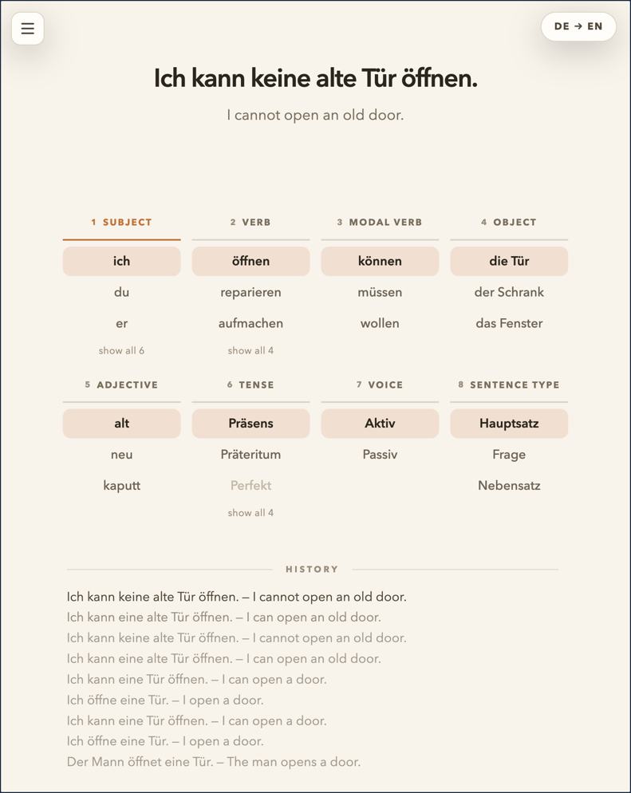

# [satz-satz](https://github.com/formatq/satz-satz) — German sentence modulator

An interactive German grammar trainer for English- and Russian-speaking beginners. Change one part of a German sentence and immediately see the grammatical ripples: articles agree, separable prefixes move, passive voice promotes the object, and subordinate clauses move the finite verb to the end.

The app starts with just **Subject · Verb · Object**. More grammar appears progressively from the hamburger menu, so learners can grow into the full trainer without meeting every concept at once.



## What it teaches

There are eight stable UI positions and keyboard shortcuts:

1. **Subject** — a noun subject (`der Mann`, `die Frau` …), or personal pronouns (`ich`, `du`, `er` …) when **Subject as pronoun** is enabled.
2. **Verb** — `öffnen`, `reparieren`, `aufmachen`, `zumachen`.
3. **Modal verb** — `können`, `müssen`, `wollen`.
4. **Object** — `die Tür`, `der Schrank`, `das Fenster`.
5. **Adjective** — `alt`, `neu`, `kaputt`.
6. **Tense** — Präsens, Präteritum, Perfekt, Futur I.
7. **Voice** — Aktiv or Vorgangspassiv.
8. **Sentence type** — statement, question, or `weil` subordinate clause.

The selected values always form a grammatical sentence. With a modal verb, Perfekt and Futur I are unavailable on purpose: the app stops before double-infinitive constructions.

The menu also offers an indefinite article (on by default), negation, object pronouns, light/dark themes, and an About panel. Object pronouns lock adjective and article settings because a pronoun cannot take either.

## Interface and controls

- Click a value to select it. Scroll over a selector, or use `↑` / `↓`, to step through values without wrapping.
- `←` / `→` move the active selector, skipping hidden dimensions. `1`–`8` jump to the corresponding visible logical position.
- A selector normally shows a three-value sliding window; **show all** expands it when needed.
- A token-level diff highlights exactly the German words changed by the latest action. The history keeps the latest 50 distinct consecutive sentences and types the newest entry.
- The top-right `DE → EN/RU` picker changes both the translations and the interface copy. Its choice is saved in `localStorage` (`satz-satz-lang`).
- The theme picker in the menu saves `satz-satz-theme`; the system colour preference is used until a choice is saved.

On wide screens up to eight 148 px selector blocks fit in one row. The layout changes to four columns at 1370 px, three at 700 px, and two at 500 px. On mobile the sentence stays sticky below the fixed corner controls while the page scrolls.

## Development

```sh
npm install
npm run dev
npm test
npm run build
```

Sentences are composed at runtime by `src/de/grammar.ts` from hand-encoded morphology tables and declarative word-order frames. No variant JSON is fetched or generated at runtime, and there are no network requests after page load. The suite contains 75 unit tests for grammar, reducer behavior, navigation, and token diffs.

## Release notes

See [CHANGELOG.md](CHANGELOG.md) for notable changes. The project follows [Semantic Versioning](https://semver.org/).

## Deploy

Pushes to `main` deploy to GitHub Pages via `.github/workflows/deploy.yml`. The workflow builds with the `/satz-satz/` base path; local development stays at `/`.

Sibling of [words-words](https://github.com/formatq/words-words), an English phrasal-verb trainer.
